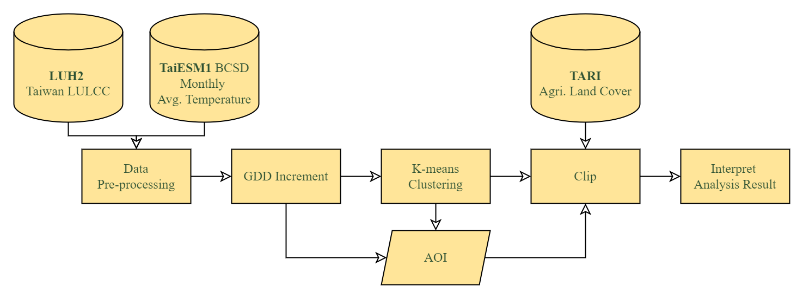

> Code for 2022 Summer Research Internship Programme, Research Center for Environmental Changes, Academia Sinica - "Challenges and Opportunities of Agricultural Land in Taiwan under two Selected Shared Socioeconomic Pathways (SSPs)"

- Data pre-processing
  - Resample -> "regrid.py"

- GDD increment
  - GDD increment for each year -> "gdd.py"
  - GDD increment for the early/mid/late 21st century(eleven year each) -> "10yr_mean.py"

- K-means clustering
  - Array to Dataframe -> "arr2df.py"
  - Decide GDD Increment cluster number -> "Kmeans_clusterNum.py"
  - K-means clustering -> "Kmeans_result.py"

---
### Workflow

